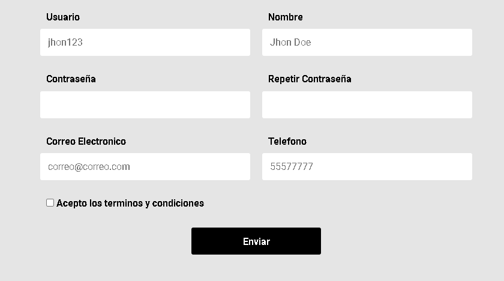

# FORMULARIO PROFESIONAL
## Descripción
Este proyecto se refiere a un formulario mas elaborado, en donde el usuario tiene que rellenar y seleccionar diferentes inputs. Este formulario tiene mas opciones de valoracion y al no cumplirlas se genera un mensaje de alerta junto con estilos tambien de alerta, esto hace que sea mas facil la interaccion con el usuario. Dicho proyecto es resultado de una practica realizada en un curso de Desarrollo Web, el cual realize por completo.
## Tecnologias Utilizadas 
Para ese proyecto se utilizaron las siguientes tecnologias:
* HTML 5
* CSS 3
* JAVASCRIPT
  
  